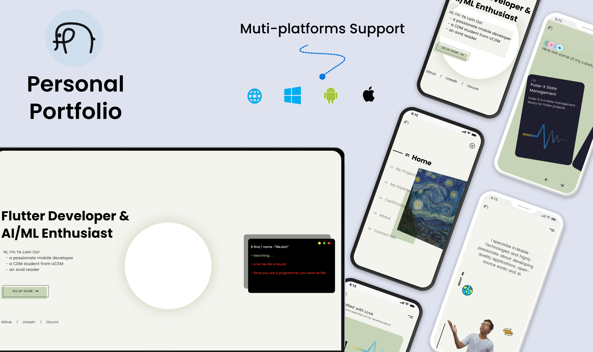

# Personal Portfolio

My Personal Portfolio website made with Flutter 🍃🍒❤️

## 📑 Overview

This is my personal portfolio website v1 built with Flutter - available for multiple platforms : website , android, ios and windows

### 🗝️ Key Features: 
- Home Page
- Projects Page
- Project Details Page
- Experiences Page
- Certificates Page
- About Page
- Contact Me Page
- Firebase Integration

### 🔗 Preview Links:

- 🕸️ [Web Version: https://yl0.me](https://yl0.me)
- 📱 [Mobile Version](http://u.pc.cd/oJ17)

### 🪪 Project License:
This project is licensed under [BSD 3-Clause License](LICENSE).

### Want a short preview?

Feel free to check it out and give it a ⭐ if you like it. 
Follow me for more updates and more projects ...

> Updated version is coming along the way ...

Copyright (©️) 2023 __YE LWIN OO__